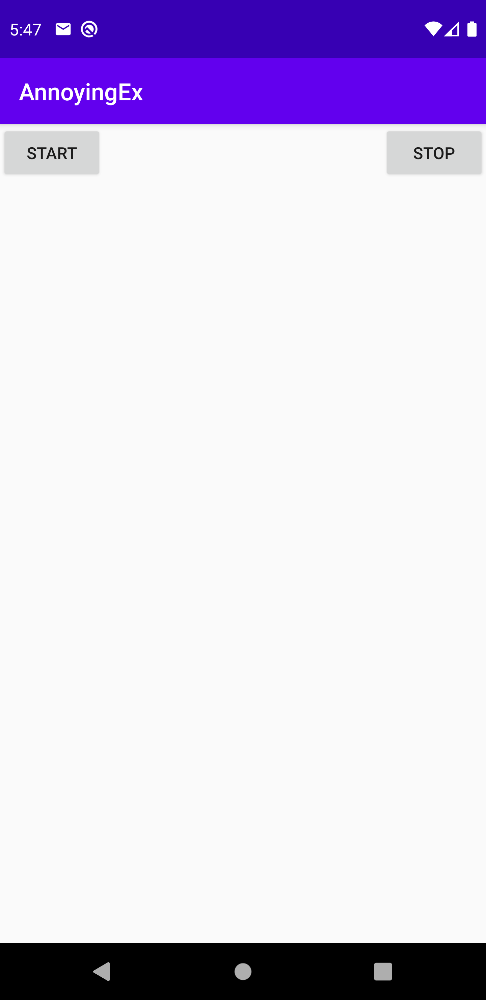

# AnnoyingEx

## Xuweiyi Chen

#### Description

 This is an android app called AnnoyingEx. It will send an message to ex every 20 mins, but I do not
 have an ex, so it will update on my own phone.

#### Attempt Extra Credit:

- Create another separate worker that runs every 2 days that fetches JSON only when the device’s
  battery is not too low and is connected to a network. (+.25)

#### Possible Error

If you can clean and rebuild the project, the error should go away.

#### ScreenShot for the Emulator

